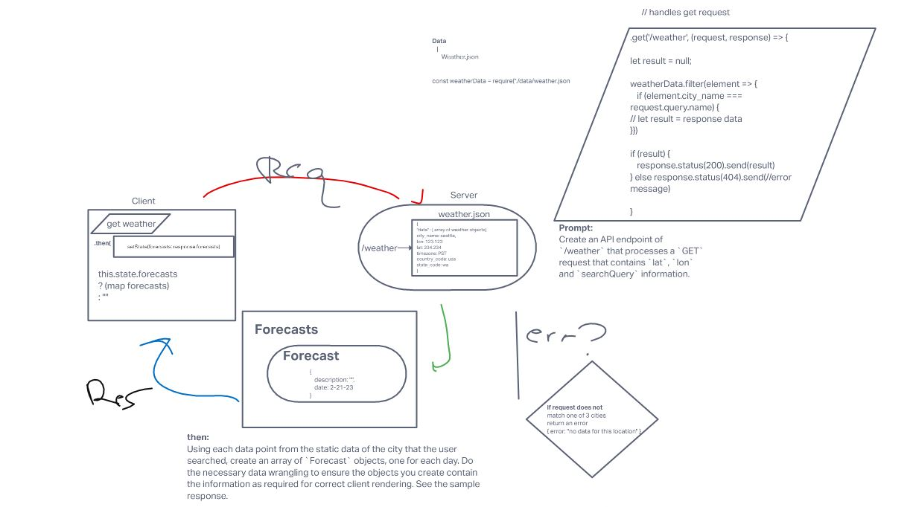

# city-explorer-api

**Author**: Kawika Miller

**Version**: 1.0.3 (increment the patch/fix version number if you make more commits past your first submission)

## Overview
This project is my first attempt at creating a server to make HTTP requests to via the city-explorer project

## Getting Started
If running this server locally you will need to define your own `.env` file and add your own access tokens / api keys from weatherbit and themoviedb

## Architecture
Javascript, Express.js, Node.js

## Change Log
2023-21-02 : Initialize project
2023-02-21 : Set up client/server wrrc functionality
2023-02-22 : Able to make proxy requests from client to server to 3rd party api and send response back to client
2023-02-23 : Refactor WRRC proxy requests | Separate weather and movie API calls to their own modules and impor them into server.js

## Credit and Collaborations
Ethan Storm: 
  - Lab07 - WRRC Client to Local Server Wireframing
  - Lab08 - WRRC Proxy Requests from Server to 3rd Party API
  - Lab09 - Refactoring WRRC proxy requests to their own modules

## Time Estimates

For each of the lab features, make an estimate of the time it will take you to complete the feature, and record your start and finish times for that feature:

### Lab07 - Handle Local Server Requests

#### **Task 01 - Set Up Server Repository**

Estimate of time needed to complete: 20m

Start time: 3:05PM

Finish time: 3:13PM

Actual time needed to complete: 8m

#### **Task 02 - Weather**

Estimate of time needed to complete: 60m

Start time: 3:14PM

Finish time: 4:51PM

Actual time needed to complete: 96m

* Took a small snack break around 4:00, lasted about 10-15m? So ~80m if not including that 

#### **Task 03 - Errors**

Estimate of time needed to complete: 60m

Start time: 4:53

Finish time: 6:22

Actual time needed to complete: 89m

* Spent like 45m-60m helping Sheldon with his Task02 before finishing my Task 03 so probably only took about 15-30m total
---
### Lab08 - Handle Proxy Requests to 3rd Party APIs

#### **Task 01 - Weatherbit API**

Estimate of time needed to complete: 60m

Start time: 3:50PM

Finish time: 5:38PM

Actual time needed to complete: 108m

#### **Task 02 - The MovieDB API**

Estimate of time needed to complete: 60m

Start time: 5:45PM

Finish time: 6:47PM

Actual time needed to complete: 62m

#### **Task 03 - Publish/Deploy Server**

Estimate of time needed to complete: 10m

Start time: 6:50PM

Finish time: 7:05PM

Actual time needed to complete: 15m

* I followed along during Jacob's demonstration earlier today so this didn't take as long to set up. My weatherbit API calls are still working but my movies api call only works when the server is run locally - gonna have to ask about that tomorrow in class.
---
### Lab 09 - Refactoring

#### **Task-01 Refactoring Server Proxy Requests**

Estimate of time needed to complete: 20m

Start time: 1:55PM

Finish time: 2:07PM

Actual time needed to complete: 12m

